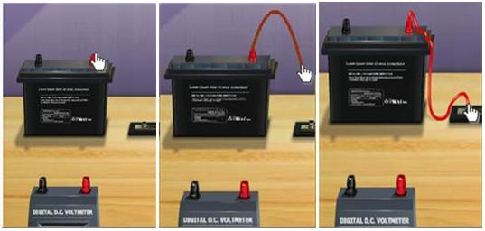
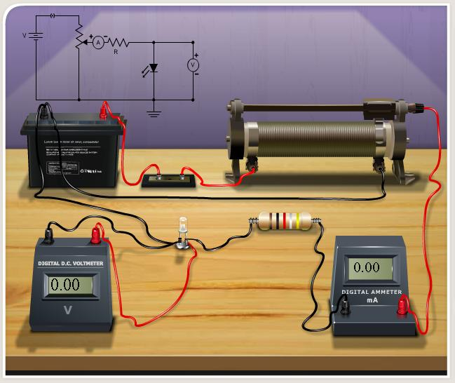

## Procedure

###  Procedure for Simulation

Click and drag from any terminal for connecting the wire.

Complete the circuite diagram as shown in the figure

After the connections are completed, click on "Insert Key" button.
Click on the combo box under "Select LED" button.
Click on the "Rheostat Value" to adjust the value of rheostat.
Corresponding voltage across the LED is measured using a voltmeter,which is the knee voltage.
Repeat, by changing the LED and note down the corresponding knee voltage.
 
Calculate "h" using equation $h=\frac{e\lambda V}{c}$
