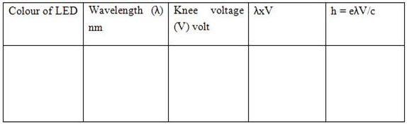
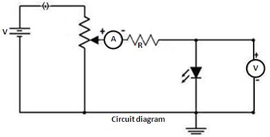

## Procedure

### Apparatus
 

0-10 V  power supply, a one way key, a rheostat, a digital milliammeter, a digital voltmeter, a 1 K resistor and different known wavelength LED's (Light-Emitting Diodes).

###  Procedure for Simulation

Click and drag from any terminal for connecting the wire.

Complete the circuite diagram as shown in the figure

1. After the connections are completed, click on "Insert Key" button.
2. Click on the combo box under "Select LED" button.
3. Click on the "Rheostat Value" to adjust the value of rheostat.
4. Corresponding voltage across the LED is measured using a voltmeter,which is the knee voltage.
5. Repeat, by changing the LED and note down the corresponding knee voltage.

6. Calculate "h" using equation $h=\frac{e\lambda V}{c}$

7. The wave length of infrared LED is calculated by using equation, $\lambda = \frac{hc}{eV}$

### Observations

### Procedure for Real lab

  
Figure 1: Description of the figure
 

<ol>
    <li>Connections are made as shown in circuit diagram.</li>
    <li>Insert key to start the experiment.</li>
    <li>Adjust the rheostat value till the LED starts glowing, or in the case of the IR diode, whose light is not visible, until the ammeter indicates that current has begun to increase.</li>
    <li>Corresponding voltage across the LED is measured using a voltmeter,which is the knee voltage.</li>
    <li>Repeat, by changing the LED and note down the corresponding knee voltage.</li>
    <li>Using the formula given,find the value of the Planck's constant.</li>
</ol>

##  Results

Planck's constant = .....................Js. 
Wavelength of IR LED    = .................nm.
