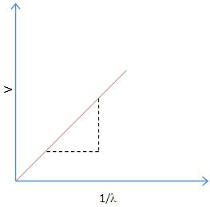

### Theory

Planck's constant (h), a physical constant was introduced by German physicist named Max Planck in 1900. The significance of Planck's constant is that "quanta" (small packets of energy) can be determined by frequency of radiation and Planck's constant. It describes the behavior of particle and waves at atomic level as well as the particle nature of light. 

An LED is a two terminal semiconductor light source. In the unbiased condition a potential barrier is developed across the p-n junction of the LED. When we connect the LED to an external voltage in the forward biased direction, the height of potential barrier across the p-n junction is reduced. At a particular voltage the height of potential barrier becomes very low and the LED starts glowing, i.e., in the forward biased condition electrons crossing the junction are excited, and when they return to their normal state, energy is emitted. This particular voltage is called the **knee voltage** or the **threshold voltage**. Once the knee voltage is reached, the current may increase but the voltage does not change.

 

The light energy emitted during forward biasing is given as ,

$$E=\frac{hc}{\lambda}............(1)$$

Where

$c$ -velocity of light. 
$h$ -Planck's constant. 
$\lambda$ -wavelength of light. 

If V is the forward voltage applied across the LED when it begins to emit light (the knee voltage), the energy given to electrons crossing the junction is,

$$E=eV................(2)$$

Equating (1) and (2), we get

$$eV=\frac{hc}{\lambda}..................(3)$$

The knee voltage V can be measured for LED's with different values of $\lambda$ (wavelength of light).

$$V=\frac{hc}{e} \left(  \frac{1}{\lambda} \right)..................(4)$$

  

 

Now from equation (4), we see that the slope s of  a graph of V on the vertical axis vs. $1/\lambda$ on the horizontal axis is

$$s=\frac{hc}{e}...............(5)$$

To determine Planck's constant h, we take the slope s from our graph and calculate

$$h=\frac{e}{c}s$$

using the known value

$$\frac{e}{c}=5.33\times 10^{-28}\frac{Cs}{m}$$

Alternatively, we can write equation (3) as

$$h=\frac{e}{c}\lambda V$$

calculate h for each LED, and take the average of our results.
 
